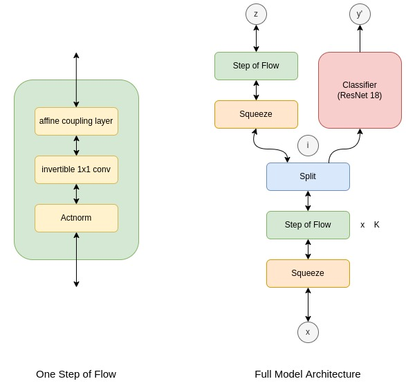

# BAI WiSe 21/22

Shrey Dixit, Daniel Speck

## Setup

Using anaconda:

```
conda env create --file environment.yml
conda activate bai
```

## Run Training

```
python train.py hparams/mnist_incremental.json mnist_incremental data
```

## Architecture

